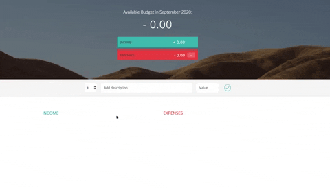

# Budgety

A small project coded in **Javascript** during the course "The complete Javascript course 2020" by Jonas Schmedtmann (Here the link 👉 
https://www.udemy.com/course/the-complete-javascript-course/).

Easily keep track of your income and expenses.

Fill in the form to get a nice clear picture of where your money is coming from and where it is going to end up. You will be given a percentage of the individual expenses and the total expenses in relation to your total budget.

Tip: every penny saved is a penny earned!

**I hope your greens are always more than your reds**

